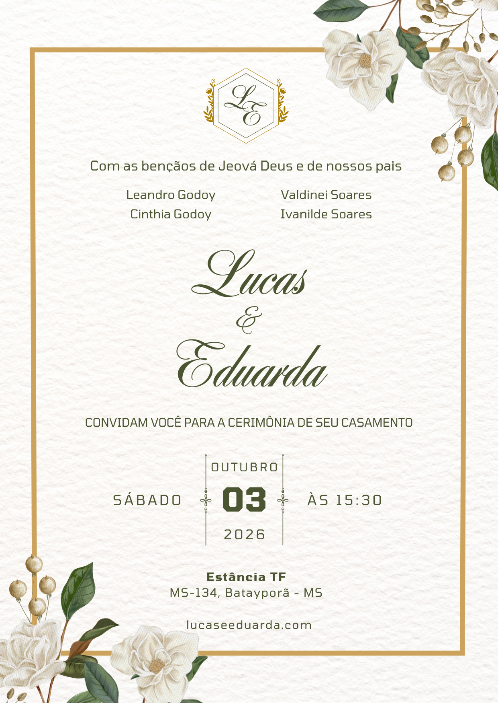

# 💍 Convite de Casamento 3D — Lucas & Eduarda

> Convite de casamento digital interativo com efeito de flip 3D, desenvolvido em HTML, CSS e JavaScript puro.

🔗 **Site do Casal:** [lucaseeduarda.com](https://lucaseeduarda.com)  
📦 **Repositório das imagens:** [DevLucasGodoy/WeddingInvitation-3D](https://github.com/DevLucasGodoy/WeddingInvitation-3D)

---

## ✨ Sobre o Projeto

Uma página web single-file que simula a experiência de abrir um convite de casamento físico. O usuário interage clicando na tela para revelar progressivamente o envelope, a frente e o verso do convite através de animações 3D suaves.

---

## 🎬 Funcionamento

A interação acontece em 3 estados sequenciais, todos ativados com um clique na tela:

| Estado          | O que aparece                                       |
| --------------- | --------------------------------------------------- |
| **1 → Inicial** | Envelope fechado                                    |
| **2 → Aberto**  | Frente do convite (flip 180°)                       |
| **3 → Verso**   | Verso do convite (flip 360°) + botão "Acessar Site" |

No estado 3, um botão aparece na parte inferior redirecionando para o site oficial do casal. Clicar novamente volta ao estado 2 (frente do convite), criando um loop entre frente e verso.

---

## 🛠️ Tecnologias

- **HTML5** — estrutura e semântica
- **CSS3** — animações 3D (`transform-style: preserve-3d`, `rotateY`, `backface-visibility`), layout fluido com `clamp()`, keyframes
- **JavaScript Vanilla** — controle de estados e eventos de clique
- **Imagens locais** — servidas do próprio deploy em `public/`, com `<picture>` (AVIF → WebP → PNG fallback)

Nenhuma dependência externa ou framework necessário.

---

## 📁 Estrutura

```text
WeddingInvitation-3D/
├── index.html        # Arquivo único com HTML, CSS e JS
├── vercel.json       # Headers de cache + segurança (deploy Vercel)
├── .gitattributes
└── public/
    ├── 1.{avif,webp,png}   # Frente do convite (3 formatos)
    ├── 2.{avif,webp,png}   # Verso do convite
    ├── 3.{avif,webp,png}   # Envelope
    └── assets/
        ├── favicon.ico
        ├── apple-touch-icon.png   # 180x180
        └── og-image.jpg           # 1200x630 (preview social)
```

> Cada imagem existe em **AVIF**, **WebP** e **PNG**. O `<picture>` no HTML entrega o formato mais leve que o navegador suporta; o PNG é o fallback final.

---

## ⚙️ Como Usar

Por ser um projeto sem dependências, basta abrir o arquivo no navegador:

```bash
# Clone o repositório
git clone https://github.com/DevLucasGodoy/WeddingInvitation-3D.git

# Abra o arquivo no navegador
open index.html
```

Ou hospede diretamente no **GitHub Pages**, **Vercel** ou qualquer servidor estático — o arquivo `index.html` é totalmente autossuficiente.

---

## 🎨 Personalização

Para adaptar o convite para outro casal ou evento, edite o `index.html`:

**Imagens do convite** — cada face usa um `<picture>` com 3 formatos. Substitua os arquivos em `public/` mantendo os nomes (`1`, `2`, `3`) ou edite os caminhos:

```html
<!-- Envelope = 3, Frente = 1, Verso = 2 -->
<picture>
  <source srcset="public/1.avif" type="image/avif" />
  <source srcset="public/1.webp" type="image/webp" />
  
</picture>
```

> Para gerar AVIF/WebP a partir de um PNG:
> `npx sharp-cli -i entrada.png -o public/ -f webp --quality 82`
> (e novamente com `-f avif --quality 55`). Se editar só o PNG, o navegador ainda vai preferir o AVIF/WebP antigo — regere os três.

**Link do botão final** — altere a URL do site do casal:

```js
window.open("https://seusite.com", "_blank");
```

**Cor de fundo** — altere no CSS de `body`:

```css
body {
  background-color: #e5ffe6;
}
```

**Preview social (WhatsApp/Facebook)** — as tags Open Graph no `<head>` apontam para o domínio final (`lucaseeduarda.com`) e para `public/assets/og-image.jpg`. Ajuste `og:url`, `og:image`, `canonical` e a imagem se mudar de domínio.

> Não há elemento de texto/instrução. O único convite ao toque é o anel dourado animado (`.seal-glow`) sobre o lacre do envelope.

---

## 📱 Responsividade

Layout **fluido, sem breakpoints de largura**: fontes, espaçamentos e offsets usam `clamp()`, e a largura do cartão é limitada pela **altura** disponível (`min(92vw, 600px, (100dvh − reserva) / 1.414)`) — o convite cabe inteiro em qualquer tela ou orientação, sem rolagem. Unidades `dvh` (com fallback `vh`) evitam corte pela barra do navegador mobile.

- Teto de 600px em desktop, centralizado
- Único media query restante: paisagem baixa (`altura ≤ 520px`) encolhe a reserva inferior
- `prefers-reduced-motion` desliga parallax, flutuação e brilhos

---

## 🚀 Deploy & Performance

Site 100% estático — deploy direto no **Vercel** (framework "Other", sem build) ou qualquer host estático.

O `vercel.json` define:

- **Cache** — imagens/fontes `immutable` por 1 ano; `index.html` sempre revalidado
- **Segurança** — `X-Content-Type-Options`, `X-Frame-Options`, `Referrer-Policy`, `Permissions-Policy`

**Peso da primeira carga:** ~5 MB (PNG) → **~270 KB (AVIF)** / ~383 KB (WebP) — redução de ~95% via conversão de formato + `<picture>`.

> ⚠️ Como as imagens têm cache `immutable` e nomes fixos, ao **trocar** uma imagem renomeie o arquivo (cache-bust) ou reduza o `max-age` no `vercel.json`.

---

## 📜 Licença

Projeto pessoal de uso livre. Sinta-se à vontade para usar como base para o seu próprio convite digital.
